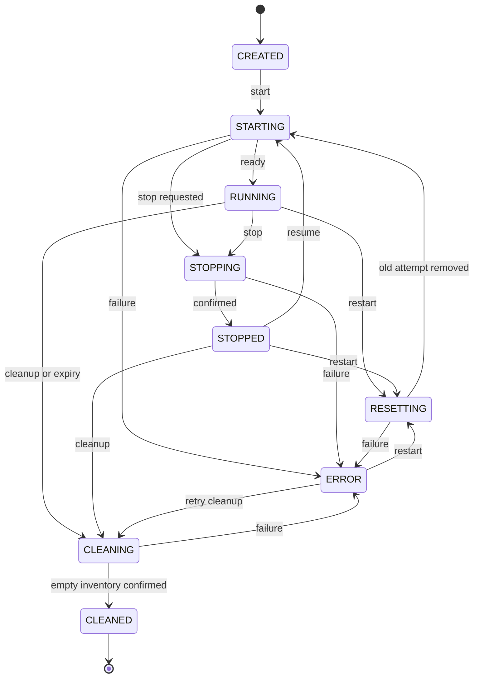

# Architecture and lifecycle — Core contract 1.0

## Boundary and decisions

The available project material contained the shared six-Astra brief, with no source repository, implementation language decision, API schema or existing adapter code. This delivery therefore creates a standalone installable `cyberpod_core` namespace. It does not rename or overwrite a frontend, infrastructure layer, desktop implementation or scenario.

The domain and lifecycle code depend on typed ports. HTTP uses aiohttp; Lab and message validation use Pydantic; YAML is parsed with a restricted SafeLoader; SQLite provides persistence. These libraries were available for execution in the build environment. FastAPI could not be installed in that environment, so it is not an undeclared or untested dependency.

The runtime adapter is selected by operator code. A Lab is selected only by its validated manifest ID. There are no Lab-ID branches, Lab-specific start methods, special target IPs, fixed container names, embedded flag comparison rules, or points calculations in Core.

| Component | Input | Output / boundary |
| --- | --- | --- |
| Registry | Operator-owned `labs/<id>/lab.yaml` | Validated definitions; reload commits the entire registry atomically |
| Engine | Authenticated commands and trusted evaluator results | Persistent lifecycle, resource ownership, progress snapshots |
| Repository | Session snapshots, evaluations, events | Durable CAS updates and transactional event cursor |
| Runtime port | Pinned definition and session ownership context | Health, resource inventory, private access service references |
| Validator port | Session context and submission | Absolute evaluation snapshot; rules belong to Astra #6 |
| AccessBroker port | Live session context and principal | Short-lived, session-bound access grants |
| Public HTTP views | Internal models | Explicitly allowed public fields; private configuration stays internal |

## Session model

Every session has a UUID, authenticated `owner_id`, Lab ID/version, deployment UUID, runtime adapter name, timestamps in UTC, a configuration hash, and a complete pinned Lab definition. `expires_at` is set at creation. Requested TTL may shorten the manifest limit but cannot extend it.

The record also includes `status`, optimistic `revision`, `generation` (starts at 1), an optional in-progress operation, resource references, private endpoint references, sanitized error information, cancellation/cleanup intent, and the last trusted progress snapshot. Public responses omit owner identity, raw provider IDs, labels, private endpoints, manifest internals, Validator configuration, environment values and secret references.

`generation` is an attempt boundary. Start after stop reuses the same attempt and progress. Restart destroys the old attempt before incrementing generation and resetting progress. Session ID, creation time, pinned definition and original expiry remain unchanged. A cleaned session is terminal; create a new session to launch again.

## Lifecycle

The diagram shows the main routes. The full allowed transition map is `engine.TRANSITIONS`; CREATED can also be stopped, reset or cleaned directly, RUNNING can become ERROR on a failed health probe, and interrupted operations become ERROR for recovery.

| Operation | Behavior |
| --- | --- |
| Create | Persist CREATED; return 201. Does not allocate resources. |
| Start | CREATED/STOPPED → STARTING; return 202. RUNNING is returned unchanged. |
| Stop | Halt workloads and revoke access; retain resources for resume. STOPPED/CLEANED are safe no-ops. |
| Restart | RESETTING → destroy old attempt → increment generation/reset progress → STARTING. Repeating after completion performs another reset. |
| Cleanup | Destroy all owned resources and confirm inventory empty before CLEANED. Also works without a preceding stop. |
| Stop during start | Persist stop intent immediately; report STOPPING. Let the adapter acknowledge cancellation, then confirm STOPPED. Never report RUNNING in between. |
| Cleanup during start/stop/reset | Persist cleanup intent and request cancellation where applicable. Destroy resources after the current provider call settles. |
| Duplicate in-progress action | Return the same operation without launching another worker. |
| Conflicting in-progress action | Return 409, except queued stop/cleanup described above. |

Scoring completion is `progress.completed`, separate from lifecycle. Completing tasks does not make containers stop automatically. The frontend displays completion alongside authoritative runtime status.

## Persistence and concurrency

The session row, lifecycle event, and applied evaluation fingerprint are committed together in SQLite transactions. Resource reports are committed as soon as the adapter reports allocations. Compare-and-swap revisions reject stale writers. Per-session asynchronous locks serialize state updates while runtime I/O runs outside those locks. Create requests use a separate short lock for atomic idempotency and quotas.

Background lifecycle workers are registered with Engine and awaited during shutdown; browser disconnects do not cancel them. API 202 responses are acknowledgments, not success reports. The operation remains stored while provider work runs. Startup recovery sees any unfinished intent.

An OS lease prevents two Core processes from opening the same SQLite database, including two processes on different ports. This is not a distributed lock and must not be used on a shared network filesystem. The Repository protocol is the extension point for a transactional shared database, but horizontal workers also require durable job dispatch, distributed session locks/fencing and a cluster-aware runtime. None are claimed in this delivery.

## Ownership and cleanup

Resource references contain provider IDs, kind, logical manifest IDs, labels and private metadata. Session IDs and generations produce unique namespaces, while actual provider names and addresses are chosen by Astra #2.

All resources must be labeled at allocation with the exact ownership context:

| Key | Value |
| --- | --- |
| `cyberpod.managed` | `true` |
| `cyberpod.deployment` | Persistent deployment UUID from the database |
| `cyberpod.session` | Session UUID |
| `cyberpod.generation` | Decimal attempt number |

Core rejects resource reports/inventory that conflict with ownership or contain duplicate identities. The provider's cleanup implementation must discover by **all** ownership labels, including resources allocated before a report or before a process crash. It must never perform global prune, delete by a loose name prefix, or infer ownership solely from a provider-supplied container name.

Cleanup first asks the provider to revoke ingress and destroy owned resources, then independently requests an inventory. CLEANED requires zero resources, zero endpoints and confirmed STOPPED health. Failure retains the durable ledger, marks ERROR and leaves cleanup requested for a later retry. Already removed resources are successful no-ops. A partial-start failure attempts immediate compensation; an ERROR record remains to show that startup failed even if compensation removed everything.

## Expiry, health and recovery

The monitor first schedules expired sessions and pending cleanup retries, then probes running sessions with at most eight concurrent probes and a three-second per-probe deadline. The default sweep interval is ten seconds. Default startup/operation/integration deadlines are 120/30/15 seconds. These are Engine constructor settings; an adapter must honor cancellation and cannot continue allocating in an untracked background task after timeout.

Expiry is checked at start/restart, flag/result submission, access issuance, and after startup. An expired session cannot gain more runtime through restart. Cleanup is eventually completed by the monitor; the exact removal delay depends on provider response times. If Core is offline, Astra #2 must independently enforce TTL and revoke access. `SessionContext.expires_at` provides the deadline for an infrastructure watchdog.

On boot, interrupted transitional sessions are marked for cleanup; Core does not guess whether an interrupted start/reset succeeded. Unexpired RUNNING sessions are checked against provider inventory. A missing/unhealthy runtime changes the record to ERROR and schedules cleanup. Manifest changes/removal do not prevent cleanup because each session retains its original definition and runtime identity. A different runtime adapter cannot destroy the previous adapter's resources.

## Errors and logging

Public errors use stable codes, concise messages and server-generated request IDs. Request validation never returns Pydantic's raw input data, which could contain a submitted flag. HTTP logs include route templates, methods, status codes and request IDs; Core logs include lifecycle/session identifiers and error types. Bearer tokens, flag values, environment values, query strings and provider exception text are excluded.

Database backups must include durable SQLite state using a supported SQLite backup method, or be taken while Core is stopped; copying only a live main database file can omit WAL transactions. Loss of the database destroys Core's ownership ledger and idempotency history. Restore the deployment identity before any cleanup reconciliation.

