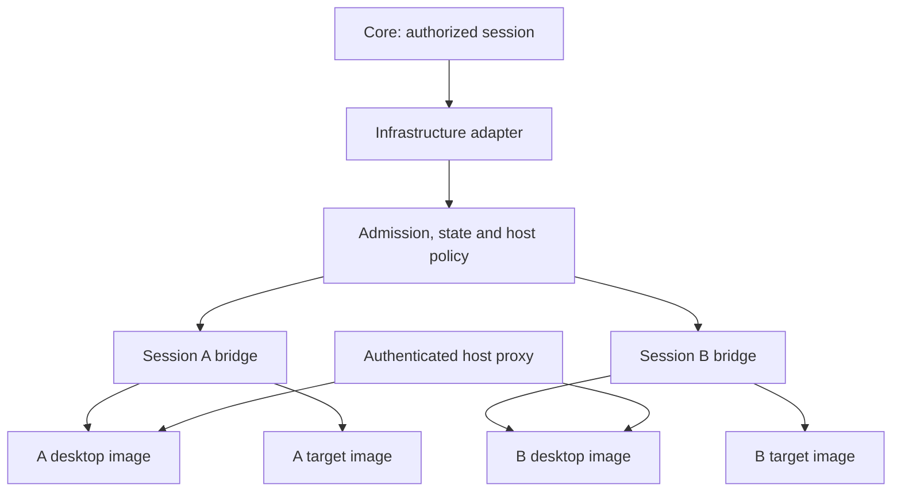

# Infrastructure architecture

## Ownership and deployment boundary

The Core chooses and authorizes a Lab and Session. This adapter runs approved image references and applies infrastructure policy. It does not interpret tasks, flags, tools, scoring or Lab names. No code branches on a particular Lab ID.

The adapter runs as a trusted host process on a **dedicated Linux worker**. It uses the local Docker Unix socket and host iptables. It is not a public HTTP service, and no workload receives its socket, host directory, capabilities or credentials. A separate trusted authenticated reverse proxy on the worker host connects to session endpoint addresses. The Core owns that proxy's authorization and routing; it is an integration dependency, not implemented here.

There is no shared training or ingress network. Cross-session access is denied by host rules. The arrows from the proxy denote trusted host-originated connections to private upstreams, not shared network attachments.

## Session orchestration

1. Validate the strict, versioned infrastructure request. Reject unknown Docker options and unsupported privileges.
2. Under a worker-wide `flock`, resolve existing intent/idempotency, check the host and firewall, enforce capacity, resolve local approved images to immutable image IDs and allocate a non-overlapping subnet.
3. Persist the generation, resource budget, subnet, expiration, cleanup identity and policy before creating Docker resources.
4. Install the session firewall policy before creating the bridge or starting workloads.
5. Create the labeled bridge and bounded temporary named volumes. Verify their configuration and ownership.
6. Generate a private Compose document; create containers without starting them; inspect applied privilege, resource, health and mount settings.
7. Audit firewall policy again, start services and return `STARTING` or `READY`. `--wait` polls without holding the admission lock between polls.
8. `READY` requires every expected service to be running, unpaused, healthy and addressed on its session network. Missing/failed health checks, missing networks, crashes and deadlines produce failure. Health output is not returned because it may contain secrets.
9. Stop removes containers, then temporary volumes, then networks. Firewall rules and the private Compose file are removed only after no owned Docker resources remain.

Creation and deletion transactions are serialized on one worker to prevent competing subnet/capacity allocations. A stop arriving during a Docker creation command queues behind that bounded command; it can then destroy a session while health checks are still starting. This MVP has no distributed lock or scheduler. Scale by assigning each Session to one worker in Core, never by sharing this state directory across hosts.

## Network strategy

| Concern | Implemented behavior |
| --- | --- |
| Network ownership | One user-defined bridge per session; managed, instance, session, generation, Lab and expiration labels |
| Names | `sha256(instance + ':' + session_uuid)[:12]`; project `cp-<token>`, bridge `cp<token>`, network `cp-<token>-lab` |
| Addresses | Operator chooses an RFC1918 pool; default `10.240.0.0/16`; allocate non-overlapping `/28` subnets under the worker lock |
| Collision checks | Existing reservations, all current Docker IPv4 networks, and host routes are excluded; Docker remains the final IPAM authority |
| Service discovery | Docker DNS aliases equal manifest service IDs, such as `target`; IP addresses are never Lab constants |
| Internet disabled | Docker `internal` network plus host forwarding deny; external DNS forwarding is disabled |
| Restricted | Normal bridge with exact public IPv4 CIDR + TCP/UDP + destination-port allowlist; default deny; external DNS disabled |
| Internet | Normal bridge; public IPv4 access and configured public DNS; private, reserved, host, management and other session destinations remain blocked |
| Ingress | No workload publishes ports. Trusted processes on the worker can connect to the container IP and declared port |
| IPv6 | Network and container IPv6 disabled, with host IPv6 forwarding/input guard for `cp*` interfaces |

The worker reserves bridge names beginning `cp` and firewall chains beginning `CPINFRA-` or `CPS`. Use one adapter policy/state directory per host. Do not run unrelated interfaces with that prefix on this worker.

`CPINFRA-FWD` is the first jump in `DOCKER-USER`. Its outbound dispatcher defaults to DROP. Each session chain checks source subnet, permits communication on that same bridge, then rejects other `cp*` bridges, host-local destinations and protected routes before applying egress rules. Incoming forwarded traffic to a session is denied except replies to established connections. Lab-initiated traffic to host services is denied in `INPUT`; replies to connections initiated by the trusted worker are permitted. Host OUTPUT traffic is intentionally trusted for the reverse proxy.

Docker's `internal` network alone is insufficient for our host-service boundary: ordinary internal bridges still have a host address. The separate INPUT guard supplies that boundary while retaining worker-to-desktop connectivity. We do not use gateway mode `isolated`, because it removes the bridge host address that this host-proxy design relies on. See [Docker gateway modes](https://docs.docker.com/engine/network/port-publishing/).

The use of `DOCKER-USER` follows [Docker's iptables interface](https://docs.docker.com/engine/network/firewall-iptables/). Existing Docker chains are never flushed. Immutable base chains and exact session dispatch rules are audited before startup and during status/reconciliation. Known drift triggers cleanup, not a READY response. Native nftables mode is a separate backend and is intentionally unsupported.

External DNS uses Docker's embedded resolver with explicit per-container upstreams. `none` and `restricted` supply `127.0.0.1` as the upstream, preventing fallback to the host resolver; service aliases remain available. Restricted mode is an IP/port policy, not a domain allowlist. A domain-based restriction, full IPv6 Internet or transparent package mirror requires a separate reviewed extension. See [Docker DNS behavior](https://docs.docker.com/engine/network/).

Operator-supplied `protected_cidrs` must include management networks and public addresses/VIPs that reach control-plane services, including NAT or load-balancer addresses not visible in the worker's route table. Current host routes are also added to deny rules. Drain sessions before changing host routing or firewall configuration. Cross-worker pools must be distinct if those workers share a routed environment.

## Resource strategy

These are starting budgets to measure with Astra #3's image, not measured performance figures:

| Resource | Kali desktop | Small target | Default maximum per Session |
| --- | ---: | ---: | ---: |
| CPU ceiling | 2 | 1 | 3 |
| Memory ceiling | 2048 MiB | 512 MiB | 3072 MiB |
| PIDs/threads | 256 | 128 | 512 |
| Shared memory | 128 MiB | 32 MiB | Included in storage/memory budgets |
| Writable data | 512 MiB home + 128 MiB tmp/run | 64 MiB data + 32 MiB tmp | 1536 MiB total writable storage |
| Container logs | 2 × 5 MiB files + 1 MiB buffer | Same | Scales with service count |

Compose uses actual `cpus`, `mem_limit`, `memswap_limit`, `pids_limit`, `shm_size` and ulimits, not deploy-only hints. The adapter verifies resulting container settings. Memory and memory+swap are equal, preventing workload swap; see [Docker resource constraints](https://docs.docker.com/engine/containers/resource_constraints/).

The root filesystem is read-only. All writable paths are explicitly bounded tmpfs mounts or named `local` driver tmpfs volumes; there are no unbounded writable layers, persistent disk volumes or host binds. Image `VOLUME` declarations are rejected because they can silently create anonymous storage. Shared volume budgets are reserved once per Session, and each mounting service must leave process-memory headroom. tmpfs use is memory use and can cause OOM before the filesystem is full; it is not extra RAM. See [tmpfs accounting](https://docs.docker.com/engine/storage/tmpfs/) and [bounded local volumes](https://docs.docker.com/reference/cli/docker/volume/create/).

The default production policy targets an 8 CPU / 16 GiB worker: 6 CPU and 12 GiB allocatable, at most four Sessions, plus host reserve and a minimum disk-free check. CPU ceilings may reduce actual concurrency below the session-count maximum. Durable reservations remain until cleanup succeeds, including orphan/timeout reconciliation. Image pulls and builds are administrative operations outside Session creation; allowlisted images must already be present. Container logs are bounded, but Docker images, host journal retention and host disk quotas remain operator responsibilities.

## Cleanup and failure strategy

Cleanup discovers resources using the exact managed/instance/session label conjunction and verifies ownership again before removal. It does not depend on container naming or call a global prune. Unknown/unowned resources and foreign network attachments are never forcibly removed. A busy network or failed delete returns `CLEANUP_FAILED`, keeps the reservation, and is retried by stop/reap. Anonymous volumes attached to owned containers are removed defensively with `container rm --volumes`.

The systemd timer reconciles every 15 seconds. It checks readiness/expiration, removes failed, expired and orphan sessions, retries cleanup, and eventually removes old cleaned metadata. Expiry is enforced by the worker, not a browser timer. Docker auto-restart is disabled. A controller crash between creation steps is recovered from durable intent and ownership labels. If a Docker command times out, a five-minute reconciliation window retains capacity and firewall state because the daemon may still be finishing the operation. This is a conservative retry window, not a guarantee against a permanently wedged daemon; stop admissions and investigate a worker with recurring timeouts.

The firewall base chains remain after a session stops because they protect all sessions. Session-specific chains, Docker resources, generated Compose files and temporary writes are removed. Base images and cleaned metadata retained for one day are not per-session leaks. Intent/Compose files use mode 0600 under a 0700 directory. The private Compose file may contain injected training secrets; Core must never send it to a student.

## Security limits and risks

- Docker containers share the worker kernel. This package is not a VM-grade boundary against kernel exploits or a sufficient assurance for hostile public multitenancy by itself. Keep workers dedicated, patched and separated from the control plane. Evaluate VM or microVM workers for stronger threat models. [Docker security model](https://docs.docker.com/engine/security/).
- The infrastructure process, Docker socket and root access are trusted. A compromised host/controller can bypass all of these controls. Do not expose the CLI through an unauthenticated API or allow students to select raw images/specifications.
- Core must authorize HTTP and WebSocket proxy access by user, session, generation and expiry, and revoke routes before stop/restart. This adapter does not supply login, TLS or desktop authorization.
- Raw sockets and added capabilities are intentionally unavailable. TCP connect reconnaissance works; raw SYN scanning and tools requiring root or writable system directories need an explicit reviewed capability/image change. No such exception is silently enabled.
- Restricted egress filters network destinations, not application semantics. An allowed endpoint could provide tunneling. Full Internet allows public outbound traffic and potential abuse; enable it only for operator-approved Lab definitions and apply external organizational controls as appropriate.
- Host routing/firewall changes, NAT hairpins and unknown public control-plane endpoints require operator review and `protected_cidrs`. Detection is periodic; a host firewall being removed is not magically atomic with workload shutdown.
- Disk persistence and resume are unsupported; stop/restart destroys temporary learner data. Images must initialize a clean empty home/data directory without root and supply real application readiness.
- Neither live container hardening nor cross-session reachability has been executed in this authoring environment. Passing local policy tests is not evidence that a host's network stack enforces those policies.
